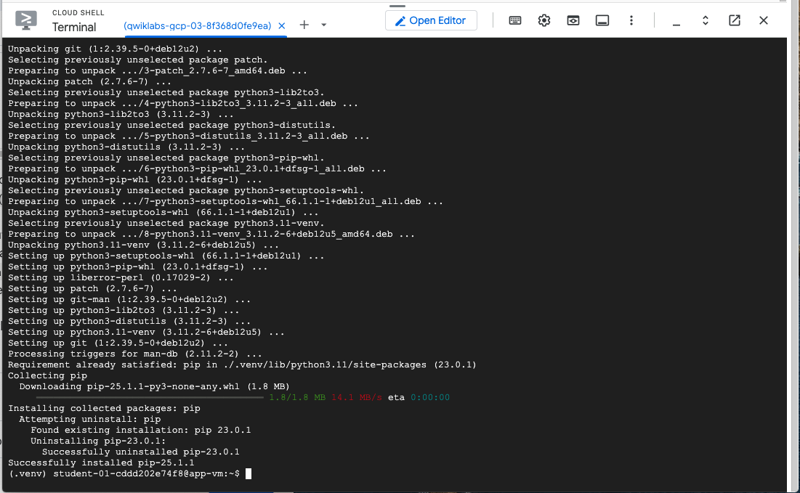
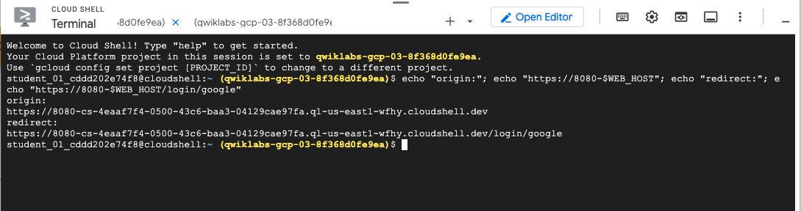
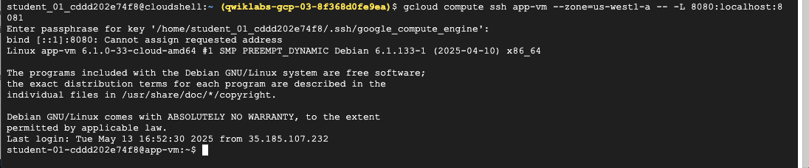

# GCP-LAB-Build-an-LLM-and-RAG-based-Chat-Application-with-AlloyDB-and-Vertex-AI
Build an LLM and RAG-based Chat Application with AlloyDB and Vertex AI


##### Overview
One of the best tools for improving the quality of responses from large language models (LLMs) is retrieval augmented generation (RAG). RAG is the pattern of retrieving some non-public data and using that data to augment your prompt sent to the LLM. RAG allows the LLM to generate more accurate responses based on the data included in the prompt.

You'll use AlloyDB, Google Cloud's scalable and performant PostgreSQL-compatible database, to store and search by a special kind of vector data called vector embeddings. Vector embeddings can be retrieved using a semantic search, which allows retrieval of the available data that is the best match for a user's natural language query. The retrieved data is then passed to the LLM in the prompt.

You'll also use Vertex AI, Google Cloud's fully-managed, unified AI development platform for building and using generative AI. Your application uses Gemini Pro, a multimodal foundation model that supports adding image, audio, video, and PDF files in text or chat prompts and supports long-context understanding.


###### What you will learn

In this lab, you'll learn:

. How RAG enhances LLM capabilities by retrieving relevant information from a knowledge base.
. How AlloyDB can be used to find relevant information using semantic search.
. How you can use Vertex AI and Google's foundation models to provide powerful generative AI capabilities to applications.


### Task 1. Initialize the database environment

In this task, you install a PostgreSQL client and connect it to the AlloyDB instance.

###### Install a PostgreSQL client

A virtual machine (VM) has been created. This VM hosts the application. You also create the PostgreSQL client on this VM.

1. To connect to the VM, run the following command:

```
gcloud compute ssh app-vm --zone=ZONE
```

If asked to authorize, click Authorize.


2. For each question asked by the gcloud compute ssh command, click Enter or Return to specify the default input.

After a short wait, you are logged into the VM.

3. To install the PostgreSQL client, in the VM session, run the following commands:

```
sudo apt-get update
sudo apt-get install --yes postgresql-client
```


>Note: The client may already be installed.

###### Connect to the AlloyDB instance

An AlloyDB instance has already been created.

1. To create required shell variables, run the following command:

```
export PGUSER=PG_USER
export PGPASSWORD=PG_PASSWORD
export PROJECT_ID=$(gcloud config get-value project)
export REGION=REGION
export ADBCLUSTER=CLUSTER
export INSTANCE_IP=$(gcloud alloydb instances describe $ADBCLUSTER-pr --cluster=$ADBCLUSTER --region=$REGION --format="value(ipAddress)")
```

2. To connect to the AlloyDB instance using psql, run the following command:

```
psql "host=$INSTANCE_IP user=$PGUSER sslmode=require"
```

psql connects to the AlloyDB database and displays a postgres=> prompt. You are now connected to the database.

3. To exit the psql session, run the following command:

```
exit
```


>Note: Do not close the SSH session.


### Task 2. Create the vector database
In this task, you use the PostgreSQL client to create the AlloyDB database and enable vector embeddings.

###### Create the database

1. To create a new database, in the VM session, run the following command:

```
export PGPASSWORD=PG_PASSWORD
psql "host=$INSTANCE_IP user=$PGUSER" -c "CREATE DATABASE assistantdemo"
```
psql responds with CREATE DATABASE.

To enable the database to support semantic searches, the entities should be represented by vector embeddings.

2. To enable vector embeddings in this database, run the following command:

```
psql "host=$INSTANCE_IP user=$PGUSER dbname=assistantdemo" -c "CREATE EXTENSION vector"

```

psql responds with CREATE EXTENSION.


### Task 3. Install Python
In this task, you install Python in the VM. Python is used to populate the database.

1. To install Python and Git, in the VM, run the following commands:

```
sudo apt install -y python3.11-venv git
python3 -m venv .venv
source ~/.venv/bin/activate
pip install --upgrade pip
```

When the installation is complete, you are left in the virtual Python environment, with a (.venv) prompt.

If the VM SSH session ever times out or the tab is closed, you can SSH into the VM again and use the command source ~/.venv/bin/activate to restart the virtual Python environment.


2. To confirm the python version, run the following command:

```
python -V
```

Your response should look similar to this:

<mark style="background-color: #E6E6FA;">

```
(.venv) student@app-vm:~$ python -V
Python 3.11.2
(.venv) student@app-vm:~$
```
</mark>




### Task 4. Populate the example database
In this task, you populate the vector database in AlloyDB with sample data. This data is used for the sample chat application.

The example application and data are stored in a GitHub repository named genai-databases-retrieval-app.

1. To clone the repo, in the VM, run the following command:

```
git clone https://github.com/GoogleCloudPlatform/genai-databases-retrieval-app.git
```


2. To see the data model, run the following command:

```
cd ~/genai-databases-retrieval-app
cat retrieval_service/models/models.py
```


The Python data models are shown here. The model includes airports, flights, amenities within the terminals, policies, and tickets.

3. To see an example of the airport data, run the following commands:

```
head -1 data/airport_dataset.csv; grep SFO data/airport_dataset.csv
```

These commands show the CSV header that specifies the column names for the airport dataset followed by the row for the San Francisco International airport (SFO). The data in the airport model can be retrieved based on the International Air Transport Association (IATA) code, or by country, city, and airport name. You can use keyword search to find rows in this table, so there are no vector embeddings for this data.

4. To see an example of the flight data, run the following commands:

```
head -1 data/flights_dataset.csv; grep -m10 "SFO" data/flights_dataset.csv
```


5. These commands show the CSV header that specifies the column names for the flights dataset followed by the first 10 rows of flights to or from SFO. The data in the flights model can be retrieved based on the airline and flight number, or by the departure and arrival airport codes.

To see an example of the amenities data, run the following command:

```
head -2 data/amenity_dataset.csv
```

This command shows the CSV header that specifies the column names for the amenities dataset followed by the first amenity.

You'll notice that the first amenity has several simple values, including name, description, location, terminal, category, and business hours. The next value is content, which incorporates the name, description, and location. The last value is embedding, the vector embedding for the row.

The embedding is an array of 768 numbers which is used when performing a semantic search. These embeddings are calculated using an AI model provided by Vertex AI. When a user provides a query, a vector embedding can be created from the query, and data with vector embeddings that are close to the search's embedding can be retrieved.

The policy data also uses vector embeddings in a similar fashion.


>Note: The calculation of embeddings takes a while, so the embeddings have already been provided. The run_generate_embeddings.py script can be examined to see how embeddings are generated.

6. To create a database configuration file, run the following commands:

```
export PGUSER=PG_USER
export PGPASSWORD=PG_PASSWORD
export PROJECT_ID=$(gcloud config get-value project)
export REGION=REGION
export ADBCLUSTER=CLUSTER
export INSTANCE_IP=$(gcloud alloydb instances describe $ADBCLUSTER-pr --cluster=$ADBCLUSTER --region=$REGION --format="value(ipAddress)")
cd ~/genai-databases-retrieval-app/retrieval_service
cp example-config.yml config.yml
sed -i s/127.0.0.1/$INSTANCE_IP/g config.yml
sed -i s/my-user/$PGUSER/g config.yml
sed -i s/my-password/$PGPASSWORD/g config.yml
sed -i s/my_database/assistantdemo/g config.yml
cat config.yml
```


The config file config.yml is created with the instance IP address, username, password, and database updated. Your configuration file should now resemble this:

```
host: 0.0.0.0
# port: 8080
datastore:
# Example for AlloyDB
kind: "postgres"
host: 10.65.0.2
# port: 5432
database: "assistantdemo"
user: "postgres"
password: "samplepassword"
```


7. To populate the database with the sample dataset, run the following commands:

```
pip install -r requirements.txt
python run_database_init.py
```


The first command adds all required packages to the Python virtual environment and the second command populates the database with the data.


### Task 5. Create a service account for the retrieval service
In this task, you create a service account for the retrieval service.

The retrieval service is responsible for extracting relevant information from the database. It extracts the necessary information from the database based on the request from an AI application. This service account is used as the identity of that Cloud Run service.

###### Create service account

The SSH user does not have permission for the project instance to provide the service account with the correct role. You create the service account using a new Cloud Shell tab.

1. In Cloud Shell, to open a new Cloud Shell tab, click Open a new tab (+).

2. To create a service account and grant it the necessary privileges, in the new tab, run the following commands:

```
export PROJECT_ID=$(gcloud config get-value project)
gcloud iam service-accounts create retrieval-identity
gcloud projects add-iam-policy-binding $PROJECT_ID \
--member="serviceAccount:retrieval-identity@$PROJECT_ID.iam.gserviceaccount.com" \
--role="roles/aiplatform.user"
```
This service account is granted the role roles/aiplatform.user, which allows the service to call Vertex AI.


3. To close the new tab, run the following command:

```
exit
```

### Task 6. Deploy the retrieval service to Cloud Run

In this task, you deploy the retrieval service to Cloud Run.

1. To deploy the retrieval service, in the VM SSH Cloud Shell tab, run the following commands:

```
export REGION=REGION
cd ~/genai-databases-retrieval-app
gcloud alpha run deploy retrieval-service \
    --source=./retrieval_service/\
    --no-allow-unauthenticated \
    --service-account retrieval-identity \
    --region $REGION \
    --network=default \
    --quiet
```

Wait a few minutes until the deployment completes.


2. To verify the service, run the following command:

```
curl -H "Authorization: Bearer $(gcloud auth print-identity-token)" $(gcloud run services list --filter="(retrieval-service)" --format="value(URL)")
```


If you see the "Hello World" message, the service is up and serving requests.


### Task 7. Register the OAuth consent screen

In this task, you register the OAuth consent screen that is presented to users who are logging in.

When you use OAuth 2.0 for authorization, Google displays a consent screen to capture the user's consent to share data with the application.

1. In the Google Cloud console, select the Navigation menu (Navigation menu icon), and then select APIs & Services > OAuth consent screen.

2. Click Get Started.

3. For App name, enter Cymbal Air.

4. Click User support email, then click the student email, and then click Next.

5. For Audience, select Internal, and then click Next.


Users with access to the project should be able to log in to the app.

6. On the left panel of the lab instructions, copy the Username.

7. For Contact information, paste the copied username.

8. Click Next.

9. Click Checkbox to agree the User Data Policy, then click Continue, and then click Create.

The consent screen is now set up.


### Task 8. Create a client ID for the application

In this task, you create a client ID for the application.

The application requires a client ID to use Google's OAuth service. You configure the allowed origins that can make this request, and a redirect URI where the web app is redirected after the user has consented to log in.

1. In the Google Cloud console, select the Navigation menu (Navigation menu icon), and then select APIs & Services > Credentials.

2. Click + Create Credentials, and then click OAuth client ID.

A client ID is used to identify a single app to Google's OAuth servers.

3. For Application type, select Web application.

4. For Name, enter Cymbal Air.

You can generate the JavaScript origin and redirect URI using Cloud Shell.

5. In Cloud Shell, to open a new Cloud Shell tab, click Open a new tab (+).

6. To get the origin and redirect URI, in the new tab, run the following commands:

```
echo "origin:"; echo "https://8080-$WEB_HOST"; echo "redirect:"; echo "https://8080-$WEB_HOST/login/google"
```



7. For Authorized JavaScript origins, click + Add URI.

>Note: Select the Add URI button under Authorized Javascript origins, not under Authorized redirect URIs.

8. Copy the origin URI that was created by the echo command, and then, for URIs 1, paste in the URI.

9. For Authorized redirect URIs, click + Add URI.

>Note: This is the second Add URI button, under Authorized redirect URIs.

10. Copy the redirect URI that was created by the echo command, and then, for URIs 1, paste in the URI.


11. Click Create.

12. The client ID and client secret are created. For this test application, you only use the client ID.


To create the environment variable, in the VM SSH Cloud Shell tab, paste the following command without clicking Enter:

```
export CLIENT_ID=
```

13. Click Copy client ID (Copy client ID icon).

The client ID is copied to the clipboard.

>Note: The client ID can also be copied from the Credentials page.

14. In the VM SSH Cloud Shell tab, paste the client ID, and then click Enter.

The export should look similar to this:

<mark style="background-color: #E6E6FA;">

```
export CLIENT_ID=937631684809-q7hs2r191jbks7f7dopih2uafuknb92h.apps.googleusercontent.com
```
</mark>


### Task 9. Deploy the sample application

In this task, you run a sample chat application that uses the retrieval service.

###### Run the application

1. To install the Python requirements for the chat application, in the VM SSH Cloud Shell tab, run the following commands:

```
cd ~/genai-databases-retrieval-app/llm_demo
pip install -r requirements.txt
```


Before starting the application, you need to set up some environment variables. The basic functionality of the application, including querying flights and returning airport amenities, requires an environment variable named BASE_URL to contain the base URL of the retrieval service.

2. To specify the base URL of the retrieval service, run the following commands:

```
export BASE_URL=$(gcloud run services list --filter="(retrieval-service)" --format="value(URL)")
echo $BASE_URL
```


The base URL is used by the local application to access the retrieval service.

3. To run the application, run the following command:

```
python run_app.py
```
Your response should look similar to this:

```
(.venv) student-03-b2f40c6c89d6@app-vm:~/genai-databases-retrieval-app/llm_demo$ python run_app.py
INFO:     Started server process [32894]
INFO:     Waiting for application startup.
Loading application...
INFO:     Application startup complete.
INFO:     Uvicorn running on http://0.0.0.0:8081 (Press CTRL+C to quit)
```
The application is now running.


###### Connect to the VM

You have several ways to connect to the application running on the VM. For example, you can open port 8081 on the VM using firewall rules in the VPC, or create a load balancer with a public IP. Here you use a SSH tunnel to the VM, translating the Cloud Shell port 8080 to the VM port 8081.

1. In Cloud Shell, to open a new Cloud Shell tab, click Open a new tab (+).

2. To create an SSH tunnel to the VM port, in the new tab, run the following command:

```
gcloud compute ssh app-vm --zone=ZONE -- -L 8080:localhost:8081
```



The gcloud command connects port 8080 in Cloud Shell with port 8081 on the VM. You can ignore the error "Cannot assign requested address."

3. To run the application in the web browser, click Web Preview, and then select Preview on port 8080.

Web Preview on port 8080


A new tab is opened in the browser, and the application is running. The Cymbal Air application prompts "Welcome to Cymbal Air! How may I assist you?"

Enter the following query:

```
When is the next flight to Dallas?
```
The application responds with the next flight from SFO to Dallas/Fort Worth.

5. Enter the following query:

```
Which restaurants are near the departure gate?
```

The application understands the context, and responds with restaurants near the departure gate in SFO.


### Task 10. Log in to the application (optional)

In this task, you log into the application to book the flight.

1. Click Sign in.

A pop-up window opens.


2. In the pop-up window, select the student.

The student account is logged in.

3. If you are asked to confirm that you want to sign in as the student, click Confirm.

4. Enter the following query:

```
Please book that flight.
```

The application presents the flight that was being discussed.

5. Click Looks good to me. Book it.

The flight is booked.

6. Enter the following query:

```
Which flights have I booked?
```

The flight you just booked is shown.

The chat app can help answer user questions like:

. When is the next flight to Miami?
. Are there any luxury shops around gate D50?
. Where can I get coffee near gate A6?

The application uses the latest Google foundation models to generate responses and augment them with information about flights and amenities from the operational AlloyDB database. You can read more about this demo application on the GitHub page of the project.

###### Congratulations!

You've successfully built a chat application that leverages large language models (LLMs) and retrieval augmented generation (RAG) to create engaging and informative conversations.

